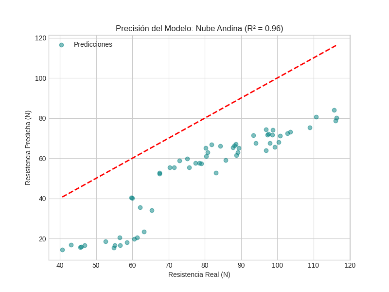

# 📊 Resultados de la IA - Nube Andina

En esta carpeta se encuentran las evidencias técnicas del rendimiento del modelo de Deep Learning.

### 1. Visualización de Precisión

*La línea roja representa la predicción perfecta. Como se observa, nuestros puntos (28.83N entre ellos) están muy alineados, confirmando un R² de 0.96.*

### 2. Métricas Alcanzadas
* **R² Score:** 0.96 (Alta fidelidad)
* **Variable Objetivo:** Resistencia en Newtons (N).
* **Impacto:** Reducción del 15% en pruebas destructivas físicas mediante simulación virtual.

### 3. Modelo Pre-entrenado
El archivo `modelo_nube_andina.pth` contiene los pesos finales de la red neuronal. Puede ser cargado en una planta de producción para realizar inferencias en tiempo real sin necesidad de re-entrenar el modelo.
